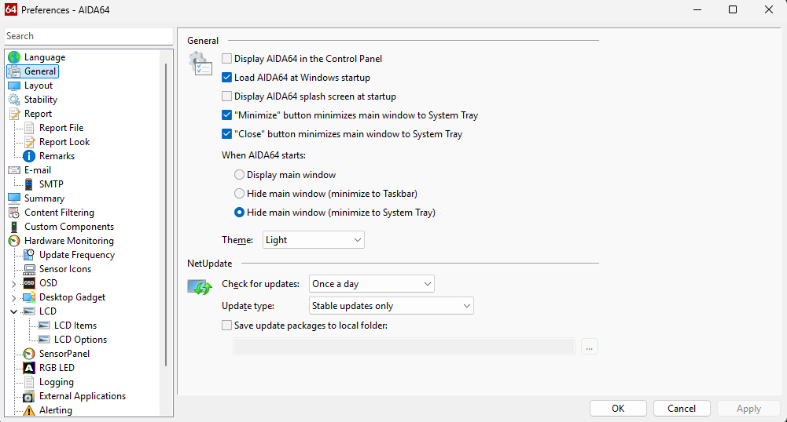
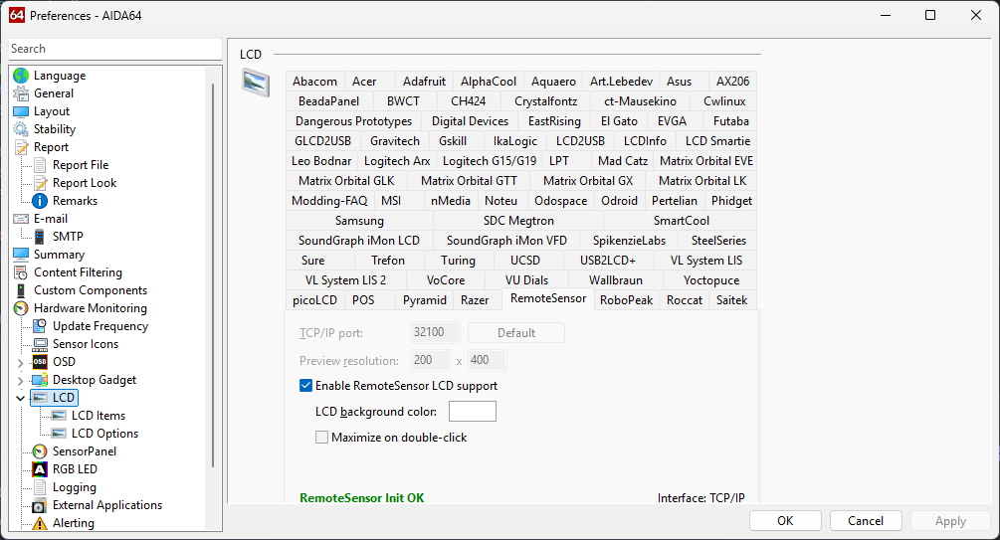
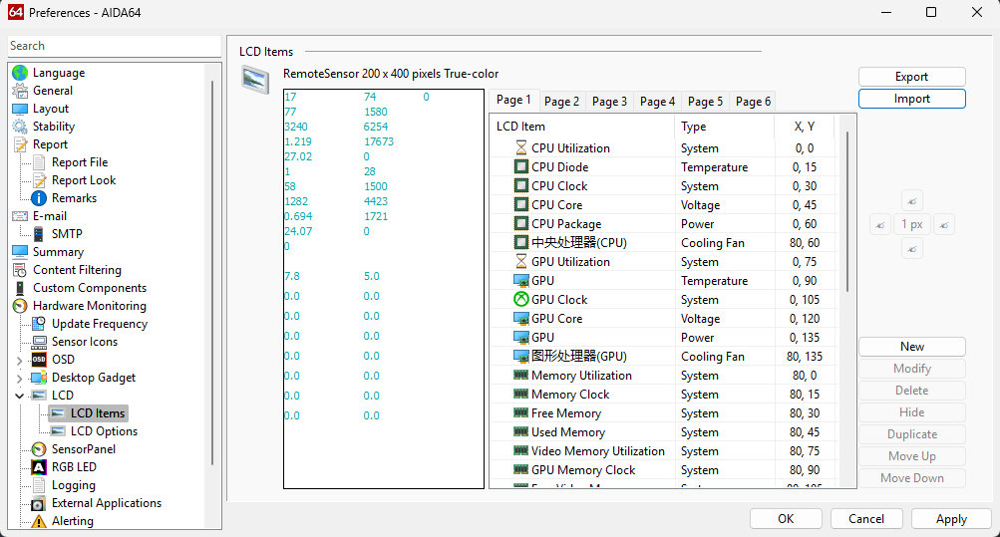
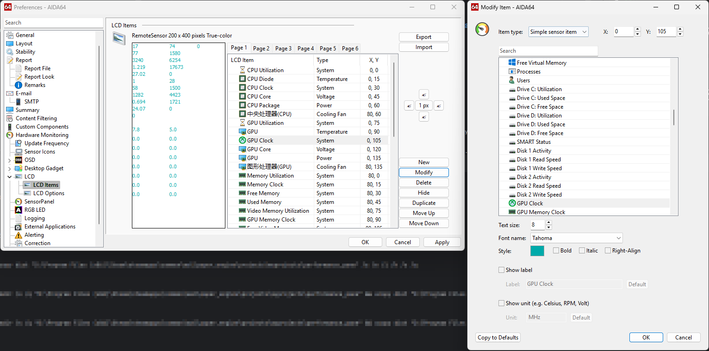

# Performance Panel

[中文](./README.md) | English

This project is a web wallpaper for Wallpaper Engine that displays performance data provided by [AIDA64](https://www.aida64.com/downloads) and [Riva Tuner Statistics Server](https://www.guru3d.com/download/rtss-rivatuner-statistics-server-download/)

# Usage Guide

## Install AIDA64 and Enable Remote Sensor

1. Download and install [AIDA64](https://www.aida64.com/downloads)
2. Run AIDA64, open preferences, configure load AIDA64 at Windows startup, minimize to system tray when closing, when AIDA64 starts Hide main window(minimize to System Tray), ensure AIDA64 runs in background after system boot
   
3. Navigate to LCD settings, find Remote Sensor, change TCP/IP port to 32100, check "Enable RemoteSensor LCD support". After applying settings, you should see "RemoteSensor Init OK" prompt
   
4. Go to LCD items, import [performance-panel-lcd-english.rslcd](./public/performance-panel-lcd-english.rslcd) file and apply
   

## Install Riva Tuner Statistics Server

1. Download and install [Riva Tuner Statistics Server](https://www.guru3d.com/download/rtss-rivatuner-statistics-server-download/)
2. Run RTSS and check "Start With Windows", then minimize it to run in background

## Apply Wallpaper Engine Wallpaper

Subscribe to [Performance Panel](https://steamcommunity.com/sharedfiles/filedetails/?id=3464821056) in Wallpaper Engine's Steam Workshop and enjoy it

# FAQ

Q: Why are some data displays incorrect?

A: Different computers may have varying LCD items in AIDA64. You'll need to manually select and modify the corresponding monitoring entries in the LCD settings.

Note: When editing, do not add, delete, or rearrange LCD items, maintain their original order please.

Q: Why is FPS not showing?

A: Please verify if Riva Tuner Statistics Server is running. If RTSS is confirmed running but still no FPS data appears when gaming, the game might not be supported by RTSS