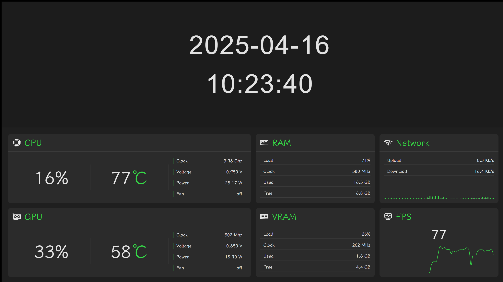
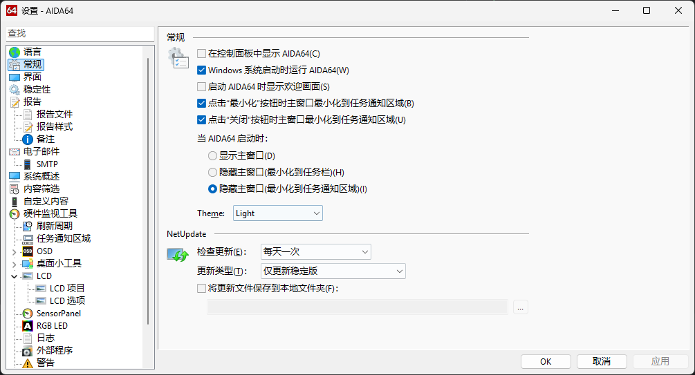
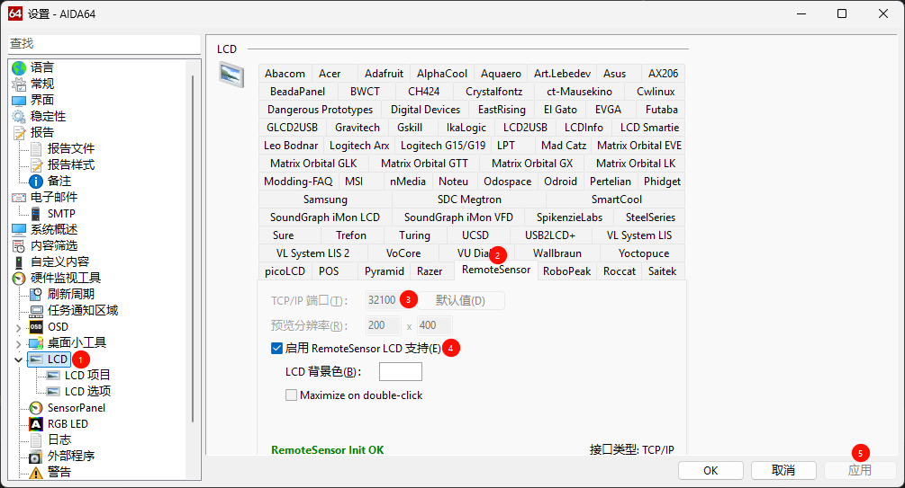
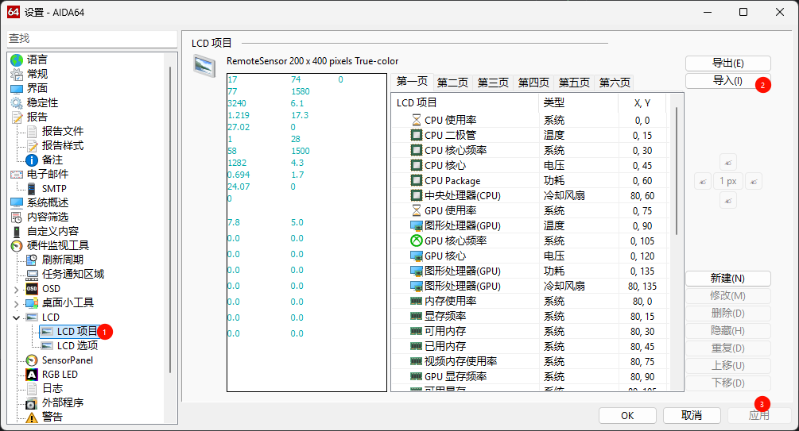
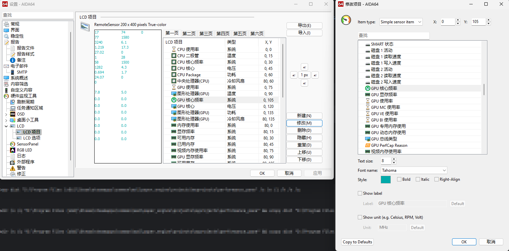

# Performance Panel

中文 | [English](./README-EN.md)

此项目为 Wallpaper Engine 的网页壁纸，展示 [AIDA64](https://www.aida64.com/downloads) 和 [Riva Tuner Statistics Server](https://www.guru3d.com/download/rtss-rivatuner-statistics-server-download/) 提供的性能数据

# 使用方法

## 安装 AIDA64 并启用 Remote Sensor

1. 下载并安装 [AIDA64](https://www.aida64.com/downloads)
2. 运行AIDA64，打开设置，设置开机自启动、最小化和关闭时最小化到任务通知区域，关闭启动时的欢迎画面，当AIDA64启动时最小化到任务通知区域，确保 AIDA64 开机后可以后台运行
   
   

3. 切换到LCD设置，找到 Remote Sensor，修改 TCP/IP 端口为 32100，勾选启用RemoteSensor LCD支持，应用设置后提示“RemoteSensor Init OK”
   
   

4. 切换到LCD-LCD项目，下载并导入 [performance-panel-lcd.rslcd](./public/performance-panel-lcd.rslcd) 文件并应用
   
   

## 安装 Riva Tuner Statistics Server

1. 下载并安装 [Riva Tuner Statistics Server](https://www.guru3d.com/download/rtss-rivatuner-statistics-server-download/)

2. 运行并勾选 Start With Windows ，点击最小化按钮使其在后台运行

## 应用 Wallpaper Engine 壁纸

在 Wallpaper Engine 的 Steam 创意工坊中订阅 [Performance Panel](https://steamcommunity.com/sharedfiles/filedetails/?id=3464821056)，即可开始享用

# 常见问题

问题: 为什么有的数据显示错误？

答： 不同的电脑中，AIDA64 监控的项目会有所不同，需要在 LCD 项目中手动选择对应的监控项进行修改。请注意修改的时候，不要新建、删除、移动项目，保持项目的顺序不变。

问题：为什么 FPS 未显示？

答：请检查 Riva Tuner Statistics Server 是否正在运行。如果确认 RTSS 正在运行，打开游戏后仍未显示 FPS 数据的话，则可能是 RTSS 不支持该游戏。
